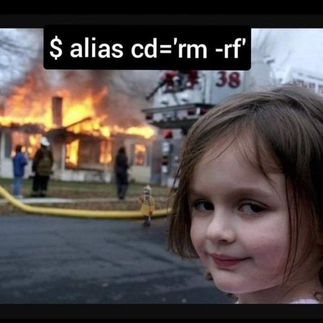

# Welcome to my github web page

## Introduction 
My name is Jiachen Ma. I'm a third-year CS student in UCSD. My current interests cover machine learning, computer vision and deep learning. 

Direct link to section: [Programming Experience](#Programming-Experience), [Personal info](#Personal-info)

Direct link to the README.md

  

## Programming Experience 
The programming languages I acquired: *Java, Python, C, C++, HTML, CSS, R, Swift*

Last summer, I became a research intern in computer vision and deep learning. I completed 3 projects along with my mentor: 
1. vehicle's shape detection
2. vehicle's plate detection
3. vehicle's plate recognition

For the first two projects, we trained yolov3 models from this repo: [yolov3-channel-and-layer-pruning](https://github.com/tanluren/yolov3-channel-and-layer-pruning.git). 

For the last project, we trained an OCR model using
> CRNN + CTCLoss

 

My several favorite memes toward programming especially my interested field: 

Here is a joke about neural network: 

Hmmm `$ alias cd='rm -rf'`: 

  

## Personal info 
I like playing basketball and video games. Though I feel my life is a bit boring, I currently have three wishes: 
- Return to UCSD (fall quarter if possible)
- Graduate and attend ~~virtual~~ commencement ceremony 
- Admitted by a good grad school
  
Besides that, here is my current my task list: 
- [x] Finish Individual Engineer Statement 
- [x] Finish Lab 1
- [ ] Finish Quiz 1